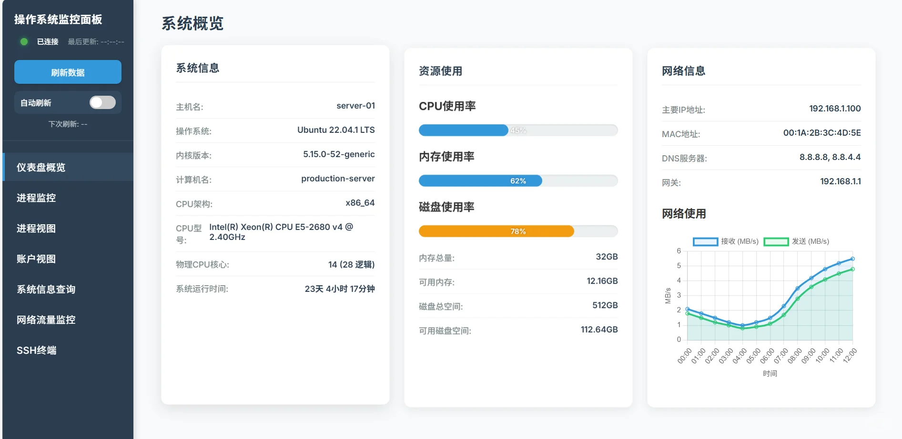
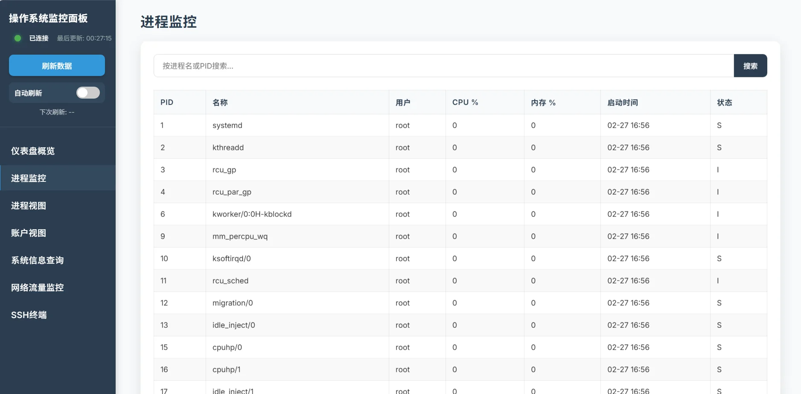
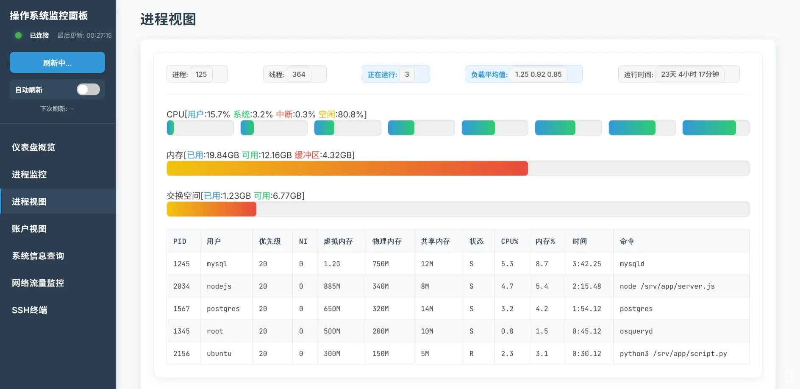
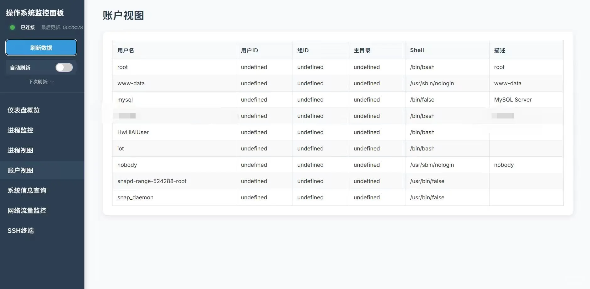
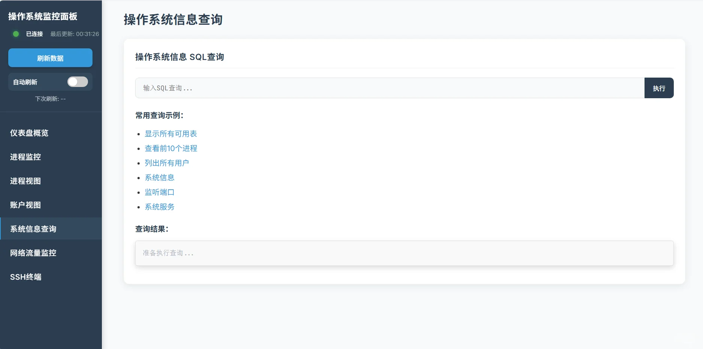
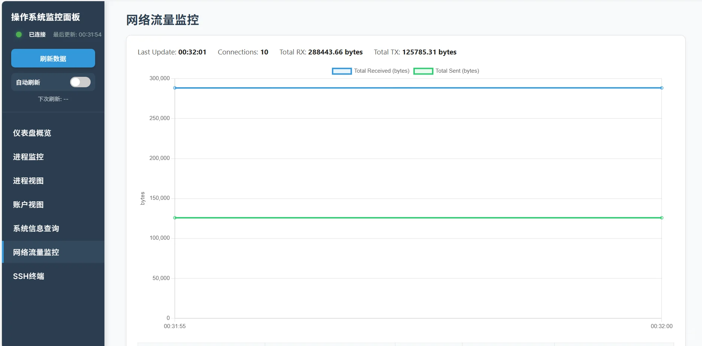
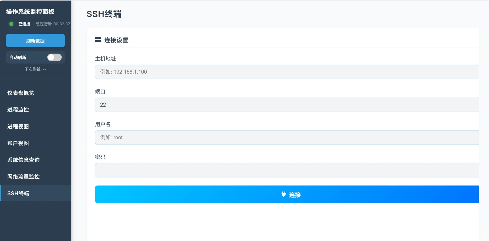

# moniOS

<p align="center">
<a ><b>English</b></a> | <a href="README.zh-CN.md"><b>中文</b></a>
</p>

A web-based operating system monitoring panel that provides functionality similar to `uname -a`, `ps -ef`, `htop`, `iftop`, and `osquery`, 
enabling you to view and analyze Linux system status through a browser.

Go [installation steps](#installation-steps) for installation.

## Features
- **System Overview**: 
Displays operating system information, resource usage, and network details
  

- **Process Monitoring**: 
htop-like process monitor to view and search system processes
  

- **Process View**: 
Provides detailed process/resource information and visualizations
  

- **User Accounts**: 
Shows system user account information
  

- **System Query**: 
SQL-based query interface using osquery to retrieve system information
  > more information please refers to [osquery docs](https://osquery.readthedocs.io/en/stable/)

  


- **Network Traffic Monitoring**: 
Real-time detailed network traffic visualization
  

- **SSH remote login:**
Login your server or other server in the web.
  

## System Requirements
- **Python 3.8+**

- **Linux OS (Ubuntu/Debian recommended)**

- **Required**: `osquery` 、`htop`、`iftop`

## Installation Steps
> You must install **htop**, **iftop**.
> In Debian/Ubuntu, you can run command:
```bash 
sudo apt install htop iftop 
```

Clone or download this repository to your Linux server:

```bash
git clone https://github.com/lrisguan/moniOS.git
cd moniOS
```

### Install Python dependencies:
- traditional way
```bash
pip install -r requirements.txt
# Install system tools:
# Visit https://osquery.io/downloads for OS-specific packages and instructions
```

- modern way

Using python modern package manager: [uv](https://github.com/astral-sh/uv)
```bash
# download uv
curl -LsSf https://astral.sh/uv/install.sh | sh
# create a viturl environments
uv sync
source .venv/bin/activate
```
> Usage
> Start the server:
> ```bash
> sudo -E python3 app.py
> # or 
> sudo -E uv run python app.py
> ```
> Access via browser:
> `http://localhost:6789`

> [!IMPORTANT]
> you must use sudo to your elevate privileges or you can't use Network Traffic Monitoring

> [!NOTE]
> if you find you could not install the required python packages, you can install them without `pip install -r requirements.txt` <br>
> instead of using pip install `packages`.


> [!TIP]
> **Network usage data** will be stored in history files for trend analysis as well as get network data successfully.<br>
> `SQL query` in the original code, you couldn't execute other SQL otherwise `SELECT` and special command of osquery like ".tables".<br>
> however you can modify the code to remove the restrictions in **/utils/osquery-handler.py**. 


## Developing Notes
To extend functionality, modify these files:

- Modules in **utils/** implement various data collection functions

- Module-specific CSS in **utils/css/**

- Module-specific JavaScript in **utils/js/**

- **app.py** contains the Flask backend API

- **static/js/api_client.js** handles frontend-API communication

- **dashboard_os_info.html** is the frontend interface
  > you can add new navbar here.

## Dependencies
*[**osquery**](https://github.com/osquery/osquery) (dual-licensed under Apache-2.0/GPL-2.0-only)*
*License: **https://osquery.io/license***
<br>
*This project integrates using the **Apache-2.0 license***

## Security Considerations
- The application listens on all network interfaces by default. For production deployments, implement authentication and firewall rules

- SQL injection protection measures are implemented for osquery functions, but usage should still be restricted to secure environments

> [!Warning]
> The hole project has no encrypted transmission! If you want to use it in your company or
> others, you'd better to have https or add other secure methods.

## Contributers
<div align=center style="margin-top: 30px;">
  <a href="https://github.com/lrisguan/monios/graphs/contributors">
    
  </a>
</div>
