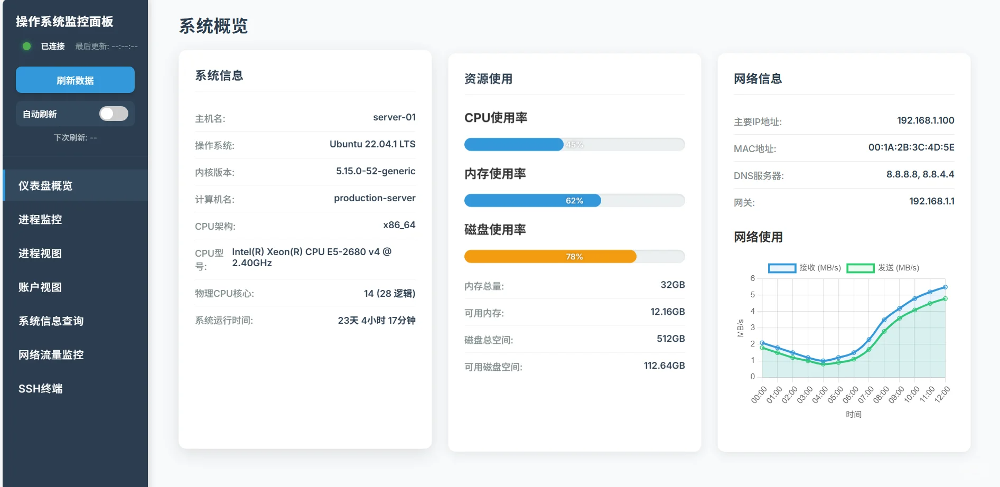
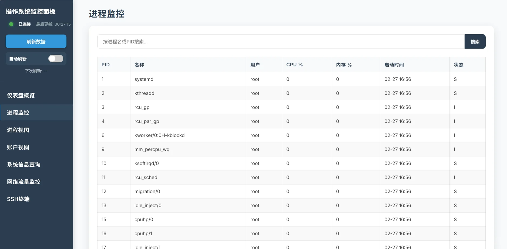
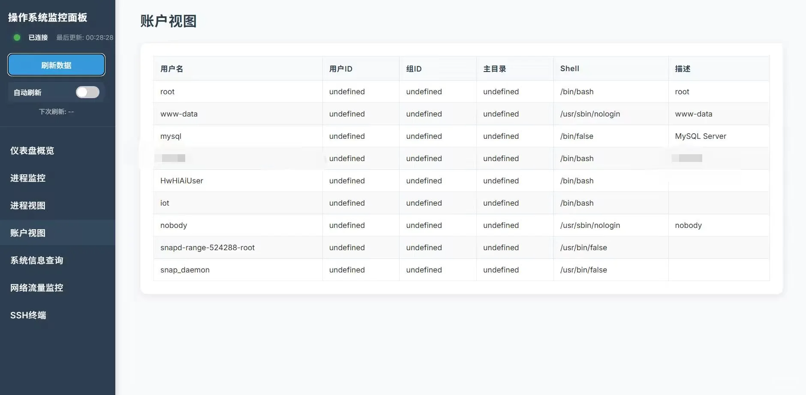
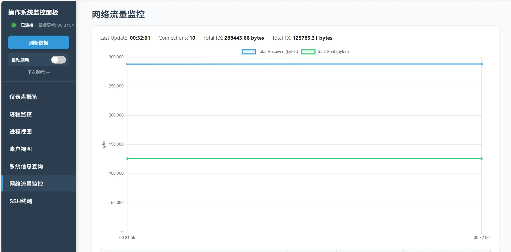

# moniOS

<p align="center">
<a href="README.md"><b>English</b></a> | <a><b>中文</b></a>
</p>

一个基于Web的操作系统监控面板，提供类似 `uname -a`、`ps -ef`、`htop`、`iftop` 和 `osquery` 的功能，
让你可以通过浏览器查看和分析Linux系统状态。

查看 [安装步骤](#安装步骤) 进行部署。

## 功能特性
- **系统概览**：
  显示操作系统信息、资源使用情况和网络详情
  

- **进程监控**：
  类htop的进程监控工具，支持查看和搜索系统进程
  

- **进程详情**：
  提供进程/资源的详细信息和可视化展示
  

- **用户账户**：
  显示系统用户账户信息
  

- **系统查询**：
  基于SQL的查询界面，通过osquery检索系统信息
  > 更多信息请参考 [osquery文档](https://osquery.readthedocs.io/en/stable/)

  

- **网络流量监控**：
  实时详细的网络流量可视化展示
  

- **SSH远程登录**：
  通过Web界面登录本地服务器或其他远程服务器
  

## 系统要求
- **Python 3.8+**

- **Linux操作系统（推荐Ubuntu/Debian）**

- **必需依赖**：`osquery`、`htop`、`iftop`

## 安装步骤
> [!Tip]
> 你可以直接运行以下脚本快速安装：
> ```bash
> curl -o monios.sh https://github.com/gzqccnu/moniOS/raw/refs/heads/main/monios.sh
> chmod +x monios.sh
> ./monios.sh
> ```
> 若上述命令无响应，可尝试使用代理加速：
> ```bash
> curl -o monios.sh https://gh-proxy.com/https://github.com/gzqccnu/moniOS/raw/refs/heads/main/monios.sh
> chmod +x monios.sh
> ./monios.sh
> ```
> 脚本将自动完成安装并启动项目

或者按照以下步骤手动安装：
> 必须先安装 **htop** 和 **iftop**。
> 在Debian/Ubuntu系统中，可运行以下命令：
```bash 
sudo apt install htop iftop 
```

将仓库克隆或下载到你的Linux服务器：

```bash
git clone https://github.com/gzqccnu/moniOS.git
cd moniOS
```

### 安装Python依赖：
- 传统方式
```bash
pip install -r requirements.txt
# 安装系统工具：
# 访问 https://osquery.io/downloads 获取对应操作系统的安装包和说明
```

- 现代方式

使用Python现代包管理器：[uv](https://github.com/astral-sh/uv)
```bash
# 下载uv
curl -LsSf https://astral.sh/uv/install.sh | sh
# 创建虚拟环境并安装依赖
uv sync
source .venv/bin/activate
```
> 使用方法
> 启动服务器：
> ```bash
> sudo -E python3 app.py
> # or 
> sudo -E uv run python app.py
> ```
> 浏览器访问：
> `http://localhost:6789`

> [!Important]
> 必须使用sudo提升权限运行，否则无法使用网络流量监控功能

> [!Note]
> 若无法通过 `pip install -r requirements.txt` 安装依赖，
> 可直接单独安装所需包：`pip install 包名`。

> [!Tip]
> - **网络使用数据** 会存储在历史文件中，用于趋势分析和数据回溯。
> - 原始代码中的 **SQL查询** 仅支持 `SELECT` 语句和osquery特殊命令（如 `.tables`），
>   如需解除限制，可修改 **/utils/osquery-handler.py** 中的相关代码。

## 开发说明
如需扩展功能，可修改以下文件：

- **utils/** 目录下的模块实现各类数据采集功能

- **utils/css/** 目录存放模块专用样式表

- **utils/js/** 目录存放模块专用JavaScript脚本

- **app.py** 包含Flask后端API逻辑

- **static/js/api_client.js** 处理前端与API的通信

- **dashboard_os_info.html** 是前端主界面
  > 可在此文件中添加新的导航栏选项

## 依赖声明
*[**osquery**](https://github.com/osquery/osquery)（双协议许可：Apache-2.0/GPL-2.0-only）*
*许可证：**https://osquery.io/license***
<br>
*本项目基于 **Apache-2.0 许可证** 集成使用osquery*

## 安全注意事项
- 应用默认监听所有网络接口。生产环境部署时，需配置身份验证和防火墙规则

- osquery功能已实现SQL注入防护，但仍建议仅在安全环境中使用

> [!Warning]
> 整个项目未提供加密传输功能！若需在企业或公共网络中使用，
> 建议配置HTTPS或其他安全防护措施。

## 贡献者
<div align=center style="margin-top: 30px;">
  <a href="https://github.com/gzqccnu/monios/graphs/contributors">
    
  </a>
</div>
